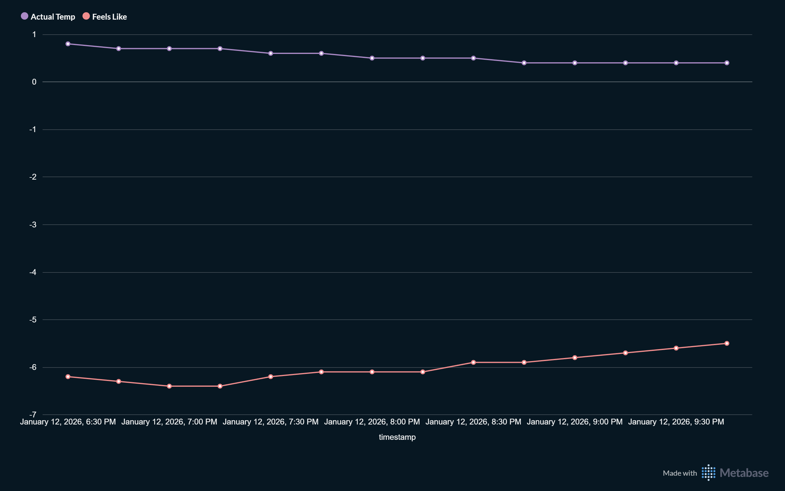

# 🌦️ End-to-End Weather ETL Pipeline (Home Lab)

A robust, containerized ETL pipeline running on TrueNAS Scale that extracts meteorological data, transforms it for analytics, and loads it into PostgreSQL.



## 🎯 Project Goal
To engineer a reliable, idempotent data pipeline that overcomes the networking limitations of **Docker Macvlan** on Linux hosts, enabling a full "Extract-Load-Visualize" lifecycle for local weather metrics.

## 🏗️ Architecture & Tech Stack

| Component | Technology | Role |
| :--- | :--- | :--- |
| **Extract** | Python (Requests) | Fetches data from Open-Meteo API. |
| **Transform** | Pandas | Cleans timestamps, detects anomalies, standardizes schema. |
| **Load** | PostgreSQL 15 | Persistent storage with rich metrics (Wind, Pressure, Rain). |
| **Infrastructure** | Docker Compose | Multi-container orchestration. |
| **Networking** | Macvlan & Shim | **Custom Host Bridge** for bidirectional communication. |
| **Visualization** | Metabase | Business Intelligence dashboarding. |

## ⚙️ Key Engineering Features

### 1. Network Bridging (The "Shim")
**Challenge:** Docker Macvlan networks provide dedicated LAN IPs to containers but isolate them from the parent host (TrueNAS) by design.
**Solution:** Implemented a custom Shell script (`shim_setup.sh`) to create a virtual bridge interface (`shim0`) on the host, manually routing traffic to the container IPs (`192.168.1.140/141`).

### 2. Idempotency & Fault Tolerance
The pipeline is designed to crash-proof the data:
* **Duplicate Handling:** Uses `SQLAlchemy` integrity error catching to gracefully skip existing records without failing the job.
* **Self-Healing Schema:** The `init_db` module automatically detects if the database is fresh and creates the schema (including 10+ metric columns) on startup.
* **Healthchecks:** Docker monitors the Python process state and restarts the container if the scheduler hangs.

## 🚀 Deployment

**1. Clone the Repo**
```bash
git clone [https://github.com/YOUR_USERNAME/weather-pipeline-homelab.git](https://github.com/YOUR_USERNAME/weather-pipeline-homelab.git)